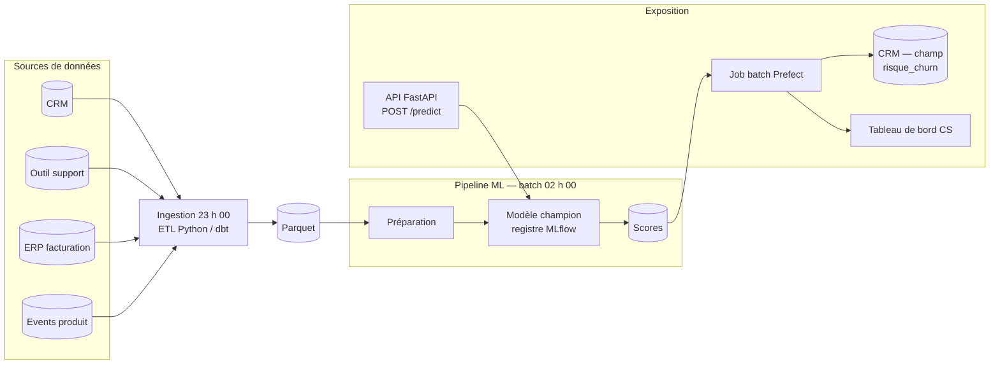
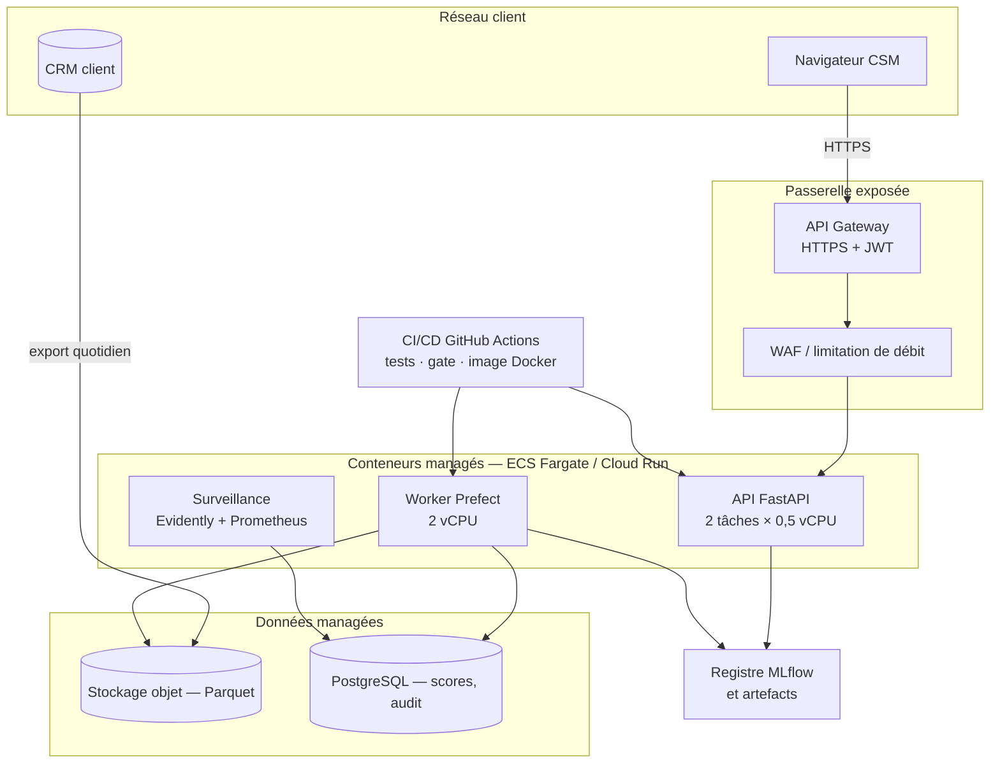
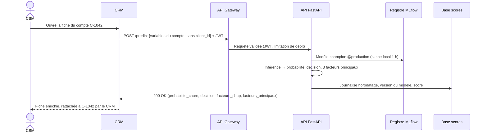

# Architecture cible — churn SaaS B2B

Document de référence technique. Les diagrammes sont recopiés de ceux du notebook §11
(source unique : `notebooks/sections/11_architecture_cible.py`) ; en cas d'écart, la section fait
foi.

---

## 1. Pipeline de données

Le batch de scoring part à 02 h 00 pour que les alertes soient dans le CRM avant 06 h 00. L'API
sert le **même** modèle champion : les vues batch et temps réel ne peuvent pas se contredire.

**Ce que le batch écrit pour chaque compte** (`flows/scoring_batch.py`, détail dans
`docs/RUNBOOK.md` §2.4) : la probabilité, le palier de la règle de décision à deux niveaux
(`ALERTE_ROUGE` ≥ 0,60, `SURVEILLANCE` au-dessus du seuil de vigilance, `OK`), le rang d'appel des
45 comptes de plus forte valeur attendue (niveau 2) et la valeur à risque. Le palier vient d'une
règle unique, `economie.niveau_risque`, partagée par l'API et le batch. Le seuil de vigilance
voyage avec le modèle : le flow de réentraînement le recalcule hors pli et l'écrit dans les
métadonnées du modèle promu.

---

## 2. Architecture cible retenue — Scénario B (conteneurs managés)

Passerelle exposée, calcul conteneurisé sans serveur à administrer, données managées et registre
de modèles alimenté **uniquement** par la CI/CD. Aucune brique ne demande Kubernetes, et chacune a
un équivalent standard ailleurs (Docker, Parquet, PostgreSQL) : c'est la réversibilité exigée par
le RSSI. L'image Docker embarque `libgomp1`, requis par LightGBM, pour que le flow puisse servir
cette famille si une future exécution du notebook la désigne (champion actuel : régression
logistique).

---

## 3. Diagramme de séquence — Score à la demande (CSM → API → CRM)

Le `client_id` ne quitte jamais le CRM ; les features dérivées (ratios comme
`intensite_support`) sont calculées côté serveur, jamais demandées au client. La cible fait
évoluer par ajout l'API livrée (même route, même contrat d'entrée) :

| Élément | API livrée (§10) | Architecture cible |
|---|---|---|
| Authentification | Clé `X-API-Key`, 60 requêtes/min par IP | JWT validé par l'API Gateway |
| Facteurs de risque | Trois règles issues de l'EDA (§6) | Valeurs SHAP locales calculées en ligne |
| Explication à la demande | Absente | `POST /explain`, mêmes variables que `/predict` |
| Journal d'audit | Absent (l'API ne persiste rien) | Chaque appel journalisé dans PostgreSQL, 12 mois |

---

## 4. Notes

- Tous les secrets (clés API, credentials DB) passent par un gestionnaire de secrets
  (AWS Secrets Manager, GCP Secret Manager ou HashiCorp Vault) — jamais en variable
  d'environnement en clair dans les images Docker.
- La souveraineté des données (hébergement UE) est contrainte par le RSSI :
  seuls des fournisseurs certifiés ISO 27001 avec région UE activée sont éligibles.
- Le scénario recommandé (B) est décrit en détail en §11 du notebook.
