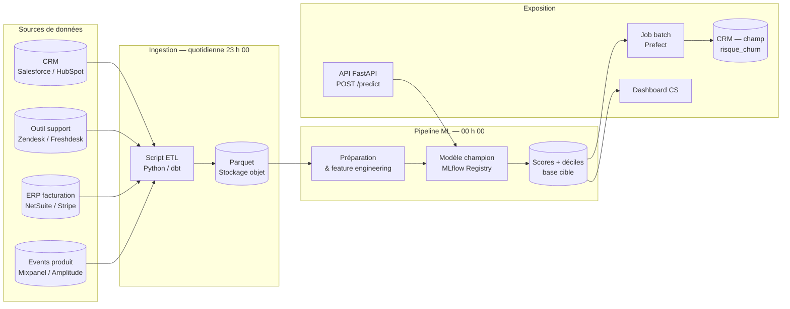
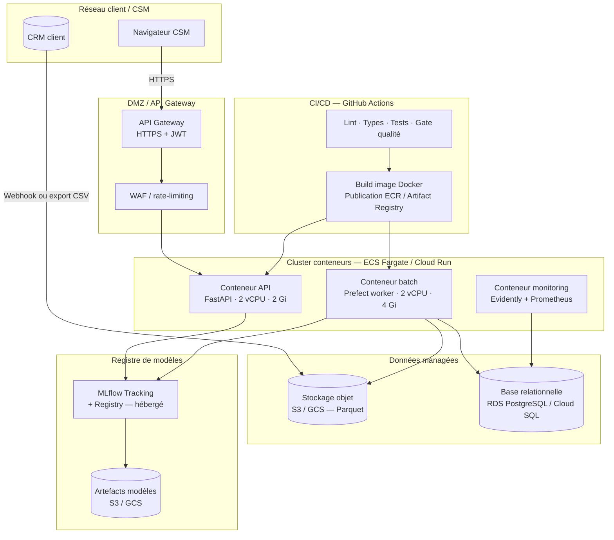
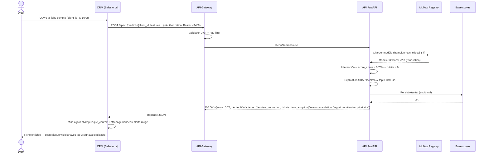

# Architecture cible — churn SaaS B2B

Document de référence technique. Les diagrammes sont identiques à ceux du notebook §11
(source unique : `notebooks/sections/11_architecture_cible.py`).

---

## 1. Pipeline de données

---

## 2. Architecture cible retenue — Scénario B (conteneurs managés)

---

## 3. Diagramme de séquence — Score à la demande (CSM → API → CRM)

---

## 4. Notes

- Tous les secrets (clés API, credentials DB) passent par un gestionnaire de secrets
  (AWS Secrets Manager, GCP Secret Manager ou HashiCorp Vault) — jamais en variable
  d'environnement en clair dans les images Docker.
- La souveraineté des données (hébergement UE) est contrainte par le RSSI :
  seuls des fournisseurs certifiés ISO 27001 avec région UE activée sont éligibles.
- Le scénario recommandé (B) est décrit en détail en §11 du notebook.
